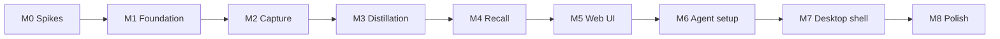

# rmb-desktop — implementation plan

> Actionable build plan derived from [local-first-desktop.md](./local-first-desktop.md).  
> Assumes all v1 decisions (D1–D22, D25–D26) are locked.

## Summary

Build a standalone local-first memory product in this order:

```text
M0 Spikes → M1 Foundation → M2 Capture → M3 Distillation → M4 Recall
    → M5 Web UI → M6 Agent setup → M7 Desktop shell → M8 Polish
```

**Target v1:** macOS + Linux, Cursor/CC/Codex hooks, BYOK distillation, hybrid search, menubar + installers.

**Out of scope v1:** sync (D23), billing (D24), CC Switch integration (D16), Windows hooks, MCP.

---

## Tech stack (locked)

| Layer | Choice |
|-------|--------|
| CLI | Go — `cmd/rmb` |
| Daemon | Go — `cmd/rmbd` |
| DB | SQLite 3 + [sqlite-vec](https://github.com/asg017/sqlite-vec) |
| FTS | FTS5 `unicode61` + optional `trigram` |
| Migrations | **goose** (pick during M0 if spike passes) |
| Timestamps | **INTEGER** unix milliseconds UTC |
| HTTP | `net/http` or **chi** / **gin** (pick one in M1) |
| LLM | OpenAI-compatible client (chat + embed) |
| Web UI | Vite + React + TypeScript, embedded via `embed.FS` |
| Menubar | Tauri v1 (Rust) |
| Default port | `19019` |

---

## Repository layout

```text
rmb-desktop/
├── cmd/
│   ├── rmb/              # CLI: hook-submit, search, cat, tree, meta, setup
│   └── rmbd/             # Daemon: serve
├── internal/
│   ├── config/           # YAML config load, paths, defaults
│   ├── db/               # SQLite open, migrations, queries
│   ├── uri/              # rmb:// parse/build
│   ├── session/          # upload, turns
│   ├── pipeline/         # L1/L2/L3 state machine
│   ├── worker/
│   │   ├── extract/      # L1
│   │   ├── scene/        # L2
│   │   ├── memory/       # L3
│   │   └── embed/        # vector fill
│   ├── recall/           # FTS + vector + RRF
│   ├── inspect/          # cat, tree, meta
│   ├── correction/       # human overrides
│   ├── skill/            # skill bundles
│   ├── llm/              # chat + embed clients, prompts
│   ├── hook/             # agent payload adapters + hook-submit
│   ├── setup/            # agent config merge (hooks.json, settings.json)
│   ├── http/             # router, handlers, embed UI
│   └── platform/         # app-data paths per OS
├── migrations/           # goose SQL (SQLite dialect)
├── prompts/              # L1/L2/L3 prompt templates (.txt)
├── ui/                   # Vite + React
├── menubar/              # Tauri project
├── install/
│   ├── macos/            # launchd plist template
│   ├── linux/            # systemd unit template
│   └── windows/          # Task Scheduler XML (later)
├── scripts/              # build, embed UI, release
├── Makefile
├── go.mod
└── plan/
```

---

## Config & paths

**Config file** (written on first run):

| OS | Default path |
|----|--------------|
| macOS | `~/Library/Application Support/rmb-desktop/config.yaml` |
| Linux | `~/.config/rmb-desktop/config.yaml` |
| Windows | `%APPDATA%\rmb-desktop\config.yaml` |

**Database:** `<app-data>/data/rmb.db`

**Example `config.yaml`:**

```yaml
addr: "127.0.0.1:19019"
db_path: ""   # empty = default beside config

llm:
  api_base: "https://api.openai.com/v1"
  api_key: ""
  model: "gpt-4o-mini"

embed:
  api_base: "https://api.openai.com/v1"
  api_key: ""
  model: "text-embedding-3-small"
  dimensions: 1024

pipeline:
  l1_poll_interval: 15s
  l2_poll_interval: 15s
  l3_poll_interval: 5m
  embed_poll_interval: 30s
```

---

## Data model (SQLite)

Core tables for M1–M3:

| Table | Purpose |
|-------|---------|
| `sessions` | Session container; `session_key`, `abstract` |
| `session_turns` | Raw messages JSONL; `l1_extracted_at` |
| `atoms` | L1 facts; UUID PK |
| `scenes` | L2 segments; UUID PK |
| `memories` | L3 versioned rows; `uri`, `superseded_at` |
| `corrections` | Human overrides; `target_uris` JSON |
| `skills` / `skill_files` | Versioned bundles |
| `pipeline_state` | Per-session L1/L2/L3 status |
| `tasks` | Async job log |
| `*_fts` | FTS5 virtual tables (memories, scenes, skills, …) |
| `vec_*` or embedding columns | sqlite-vec / BLOB vectors |

**URI column:** store full `rmb://…` string on addressable rows.

**Versioning:** `memories.superseded_at IS NULL` partial unique index on `uri`.

---

## HTTP API (rmbd)

| Method | Path | Milestone |
|--------|------|-----------|
| GET | `/healthz` | M1 |
| POST | `/api/v1/sessions/:id/upload` | M2 |
| GET | `/api/v1/search` | M4 |
| GET | `/api/v1/browse/overview` | M5 |
| GET | `/api/v1/browse/sessions` | M5 |
| GET | `/api/v1/browse/sessions/:key` | M5 |
| GET | `/api/v1/browse/atoms` | M5 |
| GET | `/api/v1/browse/scenes` | M5 |
| GET | `/api/v1/browse/memories` | M5 |
| GET | `/api/v1/browse/pipeline-state` | M5 |
| GET | `/api/v1/browse/tasks` | M5 |
| GET | `/api/v1/inspect/cat` | M4 |
| GET | `/api/v1/inspect/tree` | M4 |
| GET | `/api/v1/inspect/meta` | M4 |
| GET/PUT | `/api/v1/config` | M5 (setup page) |
| POST | `/api/v1/setup/:agent` | M6 |
| GET | `/api/v1/setup/status` | M6 |
| GET | `/ui/*` | M5 |

Bind **`127.0.0.1:19019`** only.

---

## Milestones

### M0 — Spikes (3–5 days)

**Goal:** De-risk sqlite-vec, FTS, and hook loop before committing to schema.

| Task | Done when |
|------|-----------|
| `go mod init`; Makefile with `make spike` | Builds |
| SQLite + sqlite-vec: create table, insert 1024-dim vector, cosine query | Query returns ranked results |
| FTS5: `unicode61` + `trigram` on bilingual sample text | EN + ZH queries return expected rows |
| RRF prototype: fuse vector + FTS scores | Rank order matches hand-checked fixture |
| `rmb hook-submit` stub → POST to minimal `rmbd` | 202 response; turn row inserted |
| Cursor hook payload parser (read `~/.cursor/hooks.json` format) | Unit test passes |

**Spike outcomes to record:**

- [x] sqlite-vec CGO works on darwin/arm64 (linux CI pending)
- [x] goose — selected
- [ ] Default embed model for docs: **BGE-M3** or **multilingual-e5-large**

**Exit criteria:** ✅ `plan/spike-results.md`; no blockers for M1.

---

### M1 — Foundation (1–2 weeks)

**Goal:** `rmbd serve` runs; DB migrates; health check works.

| Task | Package |
|------|---------|
| `internal/platform` — app-data dirs per OS | `platform` |
| `internal/config` — load YAML, env overrides | `config` |
| `internal/db` — open SQLite, WAL mode, goose migrate | `db` |
| `migrations/00001_baseline.sql` — sessions, turns, pipeline_state, tasks | `migrations` |
| `cmd/rmbd` — `serve` subcommand, graceful shutdown | `cmd/rmbd` |
| `internal/http` — `/healthz`, middleware, logging | `http` |
| `Makefile` — `make run`, `make test`, `make migrate` | root |
| CI — `go test ./...` on push | `.github/workflows/ci.yml` |

**Exit criteria:**

```bash
rmbd serve
curl http://127.0.0.1:19019/healthz   # {"status":"ok","db":"ok"}
```

---

### M2 — Capture (1–2 weeks)

**Goal:** Agent turns land in SQLite via hook.

| Task | Package |
|------|---------|
| `POST /api/v1/sessions/:id/upload` | `session`, `http` |
| `internal/hook` — stdin JSON parsers: cursor, cc, codex | `hook` |
| `cmd/rmb hook-submit --source=<agent>` | `cmd/rmb` |
| `internal/uri` — build `rmb://sessions/<uuid>`, `rmb://turns/<uuid>` | `uri` |
| Pipeline: mark `pipeline_state.l1 = pending` on upload | `pipeline` |
| `rmb` reads config for `addr` (default `http://127.0.0.1:19019`) | `config` |

**Exit criteria:**

```bash
# simulate hook
echo '<cursor payload>' | rmb hook-submit --source=cursor
# DB has session_turn row; pipeline_state.l1 = pending
```

---

### M3 — Distillation (2–3 weeks) ✅

**Goal:** Background workers produce atoms → scenes → memories → embeddings.

| Task | Package | Status |
|------|---------|--------|
| `internal/llm` — OpenAI-compatible chat + embed clients | `llm` | ✅ |
| `prompts/extract_atoms.txt`, `build_scenes.txt`, `distill_memory.txt` | `prompts` | ✅ |
| L1 worker — poll pending turns, LLM → atoms, FTS index | `worker/extract` | ✅ |
| L2 worker — atoms → scenes + session abstract | `worker/scene` | ✅ |
| L3 worker — cross-session memory rollup, versioning | `worker/memory` | ✅ |
| Embed worker — fill vector columns (sqlite-vec) | `worker/embed` | ✅ |
| App-level mutex for L3 global pass (D6) | `workerlock` | ✅ |
| Ingest-only when no API key (D20) | `config`, workers | ✅ |
| Migrations for atoms, scenes, memories, FTS, vectors | `migrations/00002` | ✅ |

**Exit criteria:**

- Upload 3–5 synthetic turns with API key configured
- Atoms, scenes, memories appear in DB
- Embeddings non-null on memories
- `pipeline_state` reaches idle

---

### M4 — Recall (1–2 weeks) ✅

**Goal:** Agents and operators can search and inspect memory.

| Task | Package | Status |
|------|---------|--------|
| FTS search: memories, scenes | `recall` | ✅ |
| Vector search via sqlite-vec BLOB | `recall` | ✅ |
| RRF fusion (~70/30 vector/FTS) | `recall` | ✅ |
| FTS-only fallback when no embed key | `recall` | ✅ |
| `GET /api/v1/search`, inspect handlers | `httpserver` | ✅ |
| `rmb search`, `cat`, `tree`, `meta` | `cmd/rmb` | ✅ |
| `internal/inspect` — format CLI output | `inspect` | ✅ |
| Multilingual FTS query escaping | `recall` | ✅ |

**Exit criteria:**

```bash
rmb search "kubernetes deployment"
rmb cat rmb://profile
rmb tree rmb://entities/
```

---

### M5 — Web UI (2–3 weeks)

**Goal:** Browser dashboard at `http://127.0.0.1:19019/ui/`.

| Task | Location |
|------|----------|
| Scaffold Vite + React + TS + Tailwind in `ui/` | `ui/` |
| API client → `/api/v1/*` | `ui/src/lib/api.ts` |
| Pages: Overview, Sessions, Session detail, Atoms, Scenes, Memories | `ui/src/pages/` |
| Pipeline + Tasks views | `ui/src/pages/` |
| Setup page: LLM + embed keys, save via API | `ui/src/pages/setup/` |
| `embed.FS` in `rmbd`; `go:embed ui/dist` | `internal/http/static` |
| `make ui-build` → embed → single `rmbd` binary | `Makefile` |

**Exit criteria:**

- `rmbd serve` → open `/ui/` → browse sessions and memories
- Setup page saves API keys; workers resume distillation

---

### M6 — Agent setup (1 week)

**Goal:** One-click hook registration for Cursor, CC, Codex.

| Task | Package |
|------|---------|
| `internal/setup` — merge Cursor `hooks.json` | `setup` |
| Merge Claude Code / Codex `settings.json` Stop hooks | `setup` |
| `rmb setup --agent=cursor|cc|codex` | `cmd/rmb` |
| `rmb setup status [--json]` | `cmd/rmb` |
| `POST /api/v1/setup/:agent`, `GET /api/v1/setup/status` | `http` |
| Setup page: per-agent install buttons + status | `ui/` |
| Idempotent merge; preserve unrelated keys | tests |

**Exit criteria:**

```bash
rmb setup --agent=cursor
rmb setup status
# Chat in Cursor → turn appears in UI within one hook cycle
```

---

### M7 — Desktop shell (2–3 weeks)

**Goal:** Menubar app manages `rmbd`; installs as login service.

| Task | Location |
|------|----------|
| Tauri v1 project in `menubar/` | `menubar/` |
| Tray: running / stopped indicator | menubar |
| Menu: Open Dashboard, Start/Stop, Quit | menubar |
| Open `http://127.0.0.1:19019/ui/` in default browser | menubar |
| `install/macos/com.rmb.rmbd.plist` LaunchAgent | `install/macos/` |
| `install/linux/rmbd.service` systemd user unit | `install/linux/` |
| Install script: copy binaries, write plist/unit, load service | `scripts/install.sh` |
| First-run: prompt for API keys → open setup page | menubar or UI |

**Exit criteria:**

- Login → `rmbd` auto-starts
- Menubar shows green; Open Dashboard works
- Reboot → daemon still running; hooks still work

---

### M8 — Polish & dogfood (2 weeks)

**Goal:** Shipable alpha for colleagues.

| Task | Notes |
|------|-------|
| macOS `.dmg` unsigned | `scripts/package-macos.sh` |
| Linux `.AppImage` or `.deb` | `scripts/package-linux.sh` |
| `make release` — cross-compile `rmb` + `rmbd` | arm64 + amd64 |
| README: install, setup, BYOK, troubleshooting | `README.md` |
| Document `rmb setup` after CC Switch config changes | docs |
| Dogfood with 5–10 colleagues | feedback issue template |
| Fix P0 bugs from dogfood | — |

**Exit criteria:** Colleague installs without your help; capture → distill → search works end-to-end.

---

## Testing gates (every milestone)

| Gate | Command |
|------|---------|
| Unit tests | `go test ./...` |
| Race detector (workers) | `go test -race ./internal/worker/...` |
| Lint | `golangci-lint run` (add in M1) |
| UI build | `cd ui && pnpm build` |
| E2E smoke | `scripts/smoke.sh` — upload fixture → search → UI health |

---

## Dependency graph



M5 can start in parallel with late M4 (browse API stubs) once M2 upload exists for session list.

---

## Rough timeline (one engineer, focused)

| Milestone | Duration | Cumulative |
|-----------|----------|------------|
| M0 Spikes | 3–5 days | ~1 week |
| M1 Foundation | 1–2 weeks | ~3 weeks |
| M2 Capture | 1–2 weeks | ~5 weeks |
| M3 Distillation | 2–3 weeks | ~8 weeks |
| M4 Recall | 1–2 weeks | ~10 weeks |
| M5 Web UI | 2–3 weeks | ~13 weeks |
| M6 Agent setup | 1 week | ~14 weeks |
| M7 Desktop shell | 2–3 weeks | ~17 weeks |
| M8 Polish | 2 weeks | **~19 weeks** |

Parallelizing UI (M5) with backend work can compress to **~14–16 weeks**.

---

## First week checklist (start here)

- [x] `go mod init github.com/colinleefish/rmb-desktop`
- [x] M0 spike: sqlite-vec + FTS5 + RRF in `internal/spike/`
- [x] M0 spike: Cursor hook payload sample + parser test
- [x] `migrations/00001_baseline.sql` — sessions + turns
- [x] `cmd/rmbd` — `serve` on `127.0.0.1:19019`
- [x] `cmd/rmb` — `hook-submit` POSTs to rmbd
- [x] `.github/workflows/ci.yml` — CGO + `sqlite_fts5` tests

---

## Future (post-v1)

| Item | When |
|------|------|
| Windows agent hooks | M8+ or v1.1 |
| MCP recall server | v1.1 |
| Signed macOS/notarization | before public release |
| Sync service (D23) | Phase 5 |
| Corrections + skills UI | v1.1 (schema in M3) |
